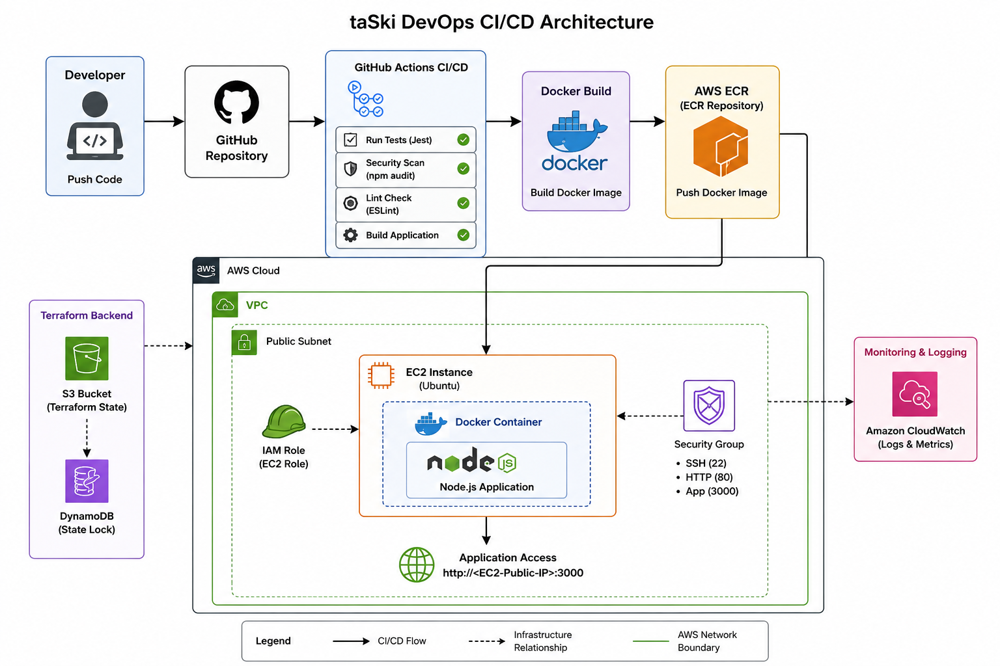
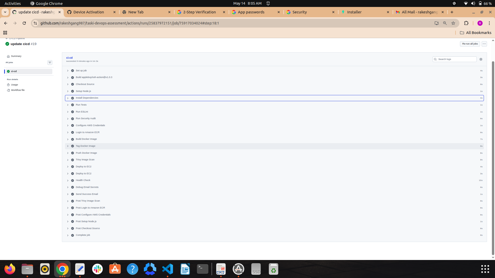

 Root README.md
# taSki DevOps Engineer Technical Assessment
  ## Overview
  
  This repository contains a complete production-style DevOps implementation for a Node.js web application as part of the taSki DevOps Engineer Technical Assessment.
  
  The project demonstrates:

- Infrastructure provisioning using Terraform
- CI/CD automation using GitHub Actions
- Docker containerization
- AWS cloud deployment
- Production-grade automation scripts
- DevOps security best practices
- Environment-based infrastructure configuration

The entire infrastructure and deployment workflow is fully automated and follows Infrastructure as Code (IaC) principles.

---

# Solution Architecture

## High-Level Flow

Developer Push → GitHub Repository → GitHub Actions Pipeline → Build & Test → Security Scan → Docker Build → Push to AWS ECR → Deploy to EC2 → Health Check

---

# Technology Stack

| Category | Technology |
|---|---|
| Cloud Provider | AWS |
| Infrastructure as Code | Terraform |
| CI/CD Platform | GitHub Actions |
| Containerization | Docker |
| Container Registry | AWS Elastic Container Registry (ECR) |
| Compute Service | AWS EC2 |
| Monitoring | AWS CloudWatch |
| Programming Language | Node.js |
| Automation Scripts | Bash |
| Version Control | Git & GitHub |

---

# Infrastructure Components

The following infrastructure components are provisioned using Terraform:

## Networking

- VPC
- Public Subnet
- Internet Gateway
- Route Tables
- Security Groups


## Compute


- EC2 Instance running Docker


## Container Registry


- AWS ECR Repository


## Terraform Backend


- S3 Bucket for remote Terraform state
- DynamoDB Table for state locking


## Security


- IAM Roles and Policies
- Security Groups with restricted access
- GitHub Secrets for sensitive values


## Monitoring & Logging


- CloudWatch Logs
- Health check endpoint


---


# Project Directory Structure


```
taski-devops-assessment/
│
├── app/
│   ├── server.js
│   ├── package.json
│   ├── Dockerfile
│   ├── .dockerignore
│   └── tests/
│
├── terraform/
│   ├── provider.tf
│   ├── main.tf
│   ├── variables.tf
│   ├── outputs.tf
│   ├── backend.tf
│   └── environments/
│       ├── dev.tfvars
│       ├── staging.tfvars
│       └── prod.tfvars
│
├── .github/
│   └── workflows/
│       └── ci-cd.yml
│
├── scripts/
│   ├── deploy.sh
│   ├── rollback.sh
│   ├── health-check.sh
│   ├── setup-env.sh
│   ├── rotate-logs.sh
│   └── README.md
│
├── docs/
│   ├── architecture-diagram.png
│   └── pipeline-success.png
│
└── README.md
```
#### Application Overview

The application is a lightweight Node.js Express web application with:

Root endpoint
Health check endpoint
Docker support
Unit testing support
CI/CD integration
Available Endpoints
Root Endpoint
```
GET /
```

Response:
```
{
  "status": "success",
  "message": "taSki DevOps Assessment App Running"
}
```
Health Check Endpoint
```
GET /health

```

Response:
```
{
  "status": "healthy"
}
```

####  Prerequisites

Before running this project, ensure the following tools are installed:
```
Tool                    Version
Node.js	                20+
Docker	                Latest
Terraform	            1.5+
AWS CLI	                Latest
Git	                    Latest

```
#####  Local Development Setup
Step 1 — Clone Repository
```
git clone https://github.com/rakeshgang987/taski-devops-assessment.git
```
Step 2 — Navigate to Project
```
cd taski-devops-assessment
```
Step 3 — Install Application Dependencies
```
cd app
npm install
```
Step 4 — Start Application
```
npm start
```
Application runs on:

http://localhost:3000

Step 5 — Test Application

Health check:
```
curl http://localhost:3000/health
```
#### Running Tests
Execute Unit Tests
```
npm test
```
Run Linting
```
npm run lint
```
#### Docker Setup
Build Docker Image

Navigate to app directory:
```
cd app
```
Build image:
```
docker build -t taski-node-app:v1 .
```
### Run Docker Container
```
docker run -d -p 3000:3000 --name taski-app taski-node-app:v1
```
Verify Running Container
```
docker ps
```
#### AWS Configuration
Configure AWS CLI
```
aws configure
```
Provide:
```
*AWS Access Key
*AWS Secret Key
*Region
*Output format
```
#### Terraform Infrastructure Deployment
Navigate to Terraform Directory
```
cd terraform
```
Initialize Terraform
```
terraform init
```
This downloads providers and configures the remote backend.

### Validate Terraform Configuration

```
terraform validate
```
Preview Infrastructure Changes
```
terraform plan -var-file="environments/dev.tfvars"
```
Deploy Infrastructure
```
terraform apply -var-file="environments/dev.tfvars"
```
Type:

yes

Terraform provisions:

VPC
Subnet
Security Group
EC2 Instance
ECR Repository
IAM Roles
CloudWatch resources

### Retrieve Outputs
```
terraform output
```
Example outputs:
```
EC2 Public IP
ECR Repository URL
```

#### CI/CD Pipeline

The project uses GitHub Actions for full CI/CD automation.

### Pipeline Flow

1. Source Stage  
Triggered on push to `main` branch

2. Build Stage  
- Install dependencies  
- Run Node.js build process  
- Build Docker image  

3. Test Stage  
- Run Jest unit tests  
- Run ESLint validation  

4. Security Scan Stage  
- npm audit (dependency scanning)  
- Trivy container image scan (vulnerability scanning)  

5. Containerization Stage  
- Build Docker image  
- Tag image with latest  
- Push to AWS ECR  

6. Deployment Stage  
- SSH into EC2 instance  
- Pull latest Docker image from ECR  
- Stop existing container  
- Run updated container  

7. Notification Stage  
- Sends email notification on success/failure of pipeline  

8. Health Check  
- Validates `/health` endpoint after deployment  
###  Security Best Practices Implemented

### Container Security Scanning

- Trivy is integrated into CI/CD pipeline
- Scans Docker images for known vulnerabilities
- Fails pipeline on HIGH/CRITICAL issues (security gate)
- Ensures production-grade secure container deployment

### Pipeline Notifications

- Email notifications configured using GitHub Actions
- Sends success/failure status after deployment
- Used instead of Slack integration

### Secrets Management
No credentials stored in source code
GitHub Secrets used for CI/CD
SSH private key secured in GitHub Secrets

### IAM Security

Principle of least privilege applied
IAM roles scoped to required services only

### Infrastructure Security
* Infrastructure managed entirely through Terraform
* No manual infrastructure changes
* Remote Terraform backend enabled
* Terraform state locking enabled

#### Container Security
* Dependency vulnerability scanning enabled
* Dockerized deployment
* Immutable deployment artifacts

### Operational Security
* Health checks implemented
* Log rotation automation included
* Deployment rollback supported

#### Monitoring & Logging

The solution includes:

* Application health checks
* CloudWatch integration
* Deployment verification

### Docker container monitoring

# Documentation Assets

## Architecture Diagram

<p align="center">
  
</p>

## CI/CD Pipeline

<p align="center">
  
</p>

Potential production enhancements:

* Kubernetes deployment
* ECS/EKS migration
* Blue/Green deployments
* Auto Scaling Groups
* Prometheus monitoring
* Grafana dashboards
* SonarQube integration
* SSL/TLS with Application Load Balancer

## Production Readiness Improvements

- Blue/Green deployments (future enhancement)
- Kubernetes migration (EKS)
- Centralized logging (ELK stack)
- Monitoring with Prometheus & Grafana
- Automated rollback on failure detection

###################################################

### Terraform Infrastructure
🧱 Terraform Infrastructure Overview

The infrastructure is fully provisioned using Terraform (Infrastructure as Code) and supports multi-environment deployments across:

Development (dev)
Staging (staging)
Production (prod)

Each environment is fully isolated using:

Separate tfvars configuration files
Environment-based naming strategy
AWS S3 backend state separation using environment-specific keys
DynamoDB state locking for concurrency safety

This ensures safe, reproducible, and environment-independent deployments.

📁 Terraform Directory Structure
terraform/

├── main.tf
├── backend.tf
├── provider.tf
├── variables.tf
├── outputs.tf
├── backend.tf
├── environments/
│   ├── dev.tfvars
│   ├── staging.tfvars
│   └── prod.tfvars
☁️ Infrastructure Components Provisioned

Terraform provisions identical infrastructure across all environments:

🌐 Networking
VPC
Public Subnet
Internet Gateway
Route Table
Route Table Association
🔐 Security

Security Group
Port 3000 (Application access)
Port 22 (SSH access)
IAM roles (if enabled)
### Compute

EC2 instance (Docker host for Node.js application)
📦 Container Registry
AWS ECR repository for Docker images
🔐 Remote State Management

Terraform state is stored remotely in AWS:

S3 Bucket: taski-terraform-state-bucket
State Locking: DynamoDB (taski-terraform-locks)
Encryption: Enabled (AES256)
📦 Environment Strategy

Each environment uses its own configuration file:

dev.tfvars
aws_region    = "us-east-1"
environment   = "dev"
instance_type = "t2.micro"
key_name      = "taski-key"
staging.tfvars
aws_region    = "us-east-1"
environment   = "staging"
instance_type = "t2.micro"
key_name      = "taski-key"
prod.tfvars
aws_region    = "us-east-1"
environment   = "prod"
instance_type = "t2.micro"
key_name      = "taski-key"

🚀 Terraform Workflow (Multi-Environment)
1. Initialize Terraform
terraform init -reconfigure

2. Select Environment (State Isolation)
Dev
terraform init -reconfigure -backend-config="key=dev/terraform.tfstate"
Staging
terraform init -reconfigure -backend-config="key=staging/terraform.tfstate"
Prod
terraform init -reconfigure -backend-config="key=prod/terraform.tfstate"

3. Validate Configuration
terraform validate
4. Plan Deployment
Dev
terraform plan -var-file="environments/dev.tfvars"
Staging
terraform plan -var-file="environments/staging.tfvars"
Prod
terraform plan -var-file="environments/prod.tfvars"

5. Apply Infrastructure
Dev
terraform apply -var-file="environments/dev.tfvars"
Staging
terraform apply -var-file="environments/staging.tfvars"
Prod
terraform apply -var-file="environments/prod.tfvars"

6. Destroy Infrastructure (Cleanup)
terraform destroy -var-file="environments/dev.tfvars"

🔒 Security Best Practices Implemented
No hardcoded secrets in Terraform code
IAM roles follow least privilege principle
Remote state stored securely in S3
State locking enabled using DynamoDB
Environment isolation prevents cross-environment impact
Security groups restrict only required ports (3000, 22)
📊 Outputs

Terraform provides:

EC2 Public IP
ECR Repository URL
Environment-specific resource identifiers

Retrieve outputs using:

terraform output
#### Design Decisions
Single Terraform codebase for all environments → reduces duplication
Environment-based tfvars → clean separation of configuration
S3 + DynamoDB backend → production-grade state management
Tag-based environment isolation → simple and effective for assessment
Reusable infrastructure pattern → scalable to real-world systems

#### Final Notes
Dev, staging, and prod are fully supported via configuration
Infrastructure is fully reproducible
No manual AWS console changes required
Same codebase promotes consistency across environments